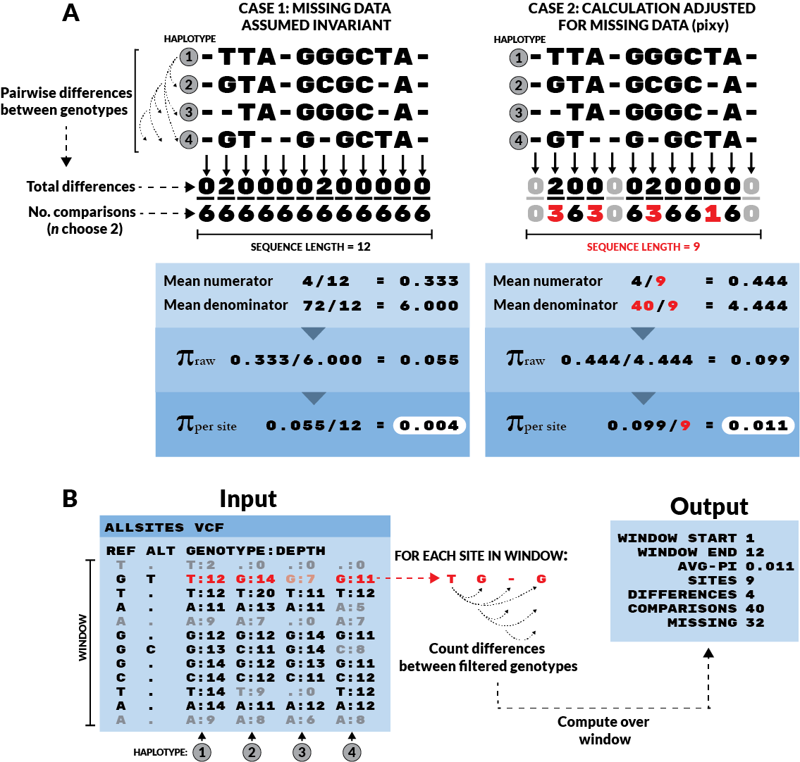

************
About pixy
************

**Authors: Katharine Korunes and Kieran Samuk, Duke University**

pixy is a command-line tool for painlessly and correctly estimating average nucleotide diversity within (π) and between (dxy) populations
from a VCF. In particular, pixy facilitates the use of VCFs containing invariant (AKA monomorphic) sites, which are essential for the 
correct computation of π and dxy:

pixy avoids common pitfalls in computing pi and dxy
#####################

Population geneticists are often interested in quantifying nucleotide diversity within and nucleotide differences between populations. 
The two most common summary statistics for these quantities were described by Nei and Li (1979), who discuss summarizing variation in the
case of two populations (denoted 'x' and 'y'):

* π - Average nucleotide diversity within populations, also sometimes denoted πx and πy to indicate the population of interest.
* dxy - Average nucleotide difference between populations, also sometimes denoted πxy (pixy, get it?), to indicate that the statistic is a 
  comparison between populations x and y.
  
Many modern genomics tools calculate π and dxy from data encoded as VCFs, which by design often omit invariant sites. With variants-only VCFs, there is often no way to distinguish missing sites from invariant sites. The schematic below illustrates this problem and how pixy avoids it. 

.. centered::
   *Figure 1 from Korunes & Samuk 2021.* 
   
In Case 1, all missing data is assumed to be present but invariant. This results in a deflated estimate of π. In Case 2, missing data are simply omitted from the calculation, both in terms of the number of sites (the final denominator) and the component denominators for each site (the n choose 2 terms). This results in an unbiased estimate of π. The adjusted π method (Case 2) is implemented for VCFs in pixy. Invariant sites are represented as sites with no ALT allele, and greyed-out sites are those that failed to pass a genotype filter requiring a minimum number of reads covering the site (Depth>=10 in this case).

Notable features of pixy
#####################

* Fast and efficient handing of invariant sites VCFs
* Computation of π and dxy for arbitrary numbers of populations
* Computes all statistics in arbitrarily sized windows, and output contains all raw information for all computations (e.g. numerators and denominators).
* The majority of this is made possible by extensive use of the existing data structures and functions found in the brilliant python library scikit-allel
