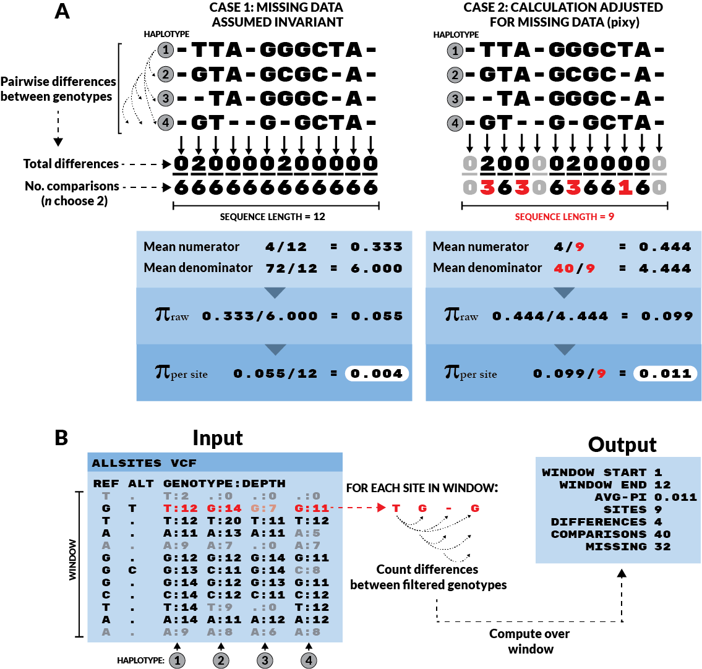

**********
About pixy
**********

**Authors: Kieran Samuk (UC Riverside) and Katharine Korunes (Duke University)**

``pixy`` is a command-line tool for painlessly and correctly estimating
population genetic summary statistics that measure genetic variation within
populations (π, θ\ :sub:`W`, Tajima's *D*) and between populations
(d\ :sub:`xy`, F\ :sub:`ST`) from a VCF. In particular, ``pixy`` facilitates
the use of VCFs containing invariant (a.k.a. monomorphic) sites, which are
essential for the correct computation of π and d\ :sub:`xy` whenever data
are missing.

pixy avoids common pitfalls in computing pi and dxy
===================================================

Population geneticists are often interested in quantifying nucleotide
diversity within and nucleotide differences between populations. The two
most common summary statistics for these quantities were described by
Nei and Li (1979), who discuss summarizing variation in the case of two
populations (denoted 'x' and 'y'):

* **π** — average nucleotide diversity within populations, also sometimes
  denoted π\ :sub:`x` and π\ :sub:`y` to indicate the population of
  interest.
* **d**\ :sub:`xy` — average nucleotide difference between populations,
  sometimes denoted π\ :sub:`xy` (*pixy*, get it?), to indicate that the
  statistic is a comparison between populations *x* and *y*.

Many modern genomics tools calculate π and d\ :sub:`xy` from data encoded
as VCFs, which by design often omit invariant sites. With variants-only
VCFs, there is often no way to distinguish missing sites from invariant
sites. The schematic below illustrates this problem and how ``pixy`` avoids
it.

.. centered::
   *Figure 1 from Korunes & Samuk 2021.*

In Case 1, all missing data is assumed to be present but invariant. This
results in a deflated estimate of π. In Case 2, missing data are simply
omitted from the calculation, both in terms of the number of sites (the
final denominator) and the component denominators for each site (the
*n choose 2* terms). This results in an unbiased estimate of π. The
adjusted π method (Case 2) is implemented for VCFs in ``pixy``. Invariant
sites are represented as sites with no ``ALT`` allele, and greyed-out
sites are those that failed to pass a genotype filter requiring a minimum
number of reads covering the site (Depth ≥ 10 in this case).

The same logic applies to the new unbiased estimators of Watterson's θ and
Tajima's *D* introduced in ``pixy 2.0``. See Bailey, Stevison & Samuk (2025)
for the derivation and a simulation-based assessment of the bias incurred
by ignoring missing data when computing these statistics.

Notable features of pixy
========================

* Fast and efficient handling of invariant-sites VCFs.
* Computation of π, d\ :sub:`xy`, F\ :sub:`ST`, Watterson's θ, and Tajima's
  *D* for arbitrary numbers of populations.
* All statistics are computed in arbitrarily sized windows, and the output
  contains the raw counts (numerators and denominators) used in every
  computation — making post-hoc aggregation across windows straightforward
  and statistically correct.
* As of ``pixy 2.0``: support for organisms of arbitrary and *variable*
  ploidy (including sex chromosomes), multiallelic sites, and both
  ``.tbi`` and ``.csi`` VCF indexes.
* Two F\ :sub:`ST` estimators available: Weir & Cockerham (1984) and
  Hudson (1992) / Bhatia *et al.* (2013).
* Heavy use of the data structures and routines from the excellent
  `scikit-allel <https://scikit-allel.readthedocs.io/>`_ library.
