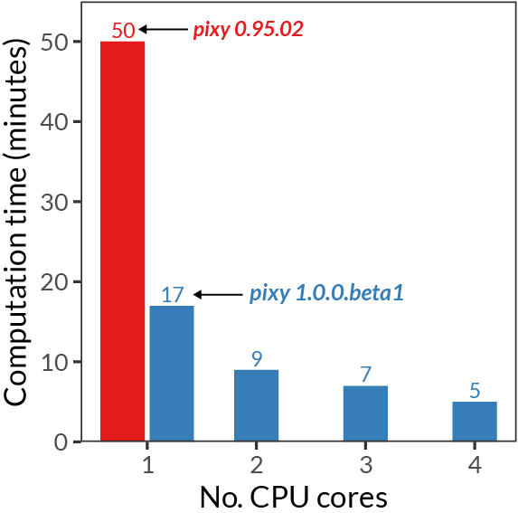
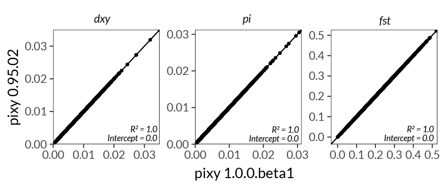

*********
Changelog
*********

Explanations of major changes to ``pixy`` are listed below. For up-to-date
info on minor versions and bugfixes, see the release notes on GitHub:
https://github.com/ksamuk/pixy/releases

Unreleased
==========

New features
------------

- **wisp companion-tool input (``--wisp_bed``).** Pass a wisp-format
  quantized callable-sites BED alongside a variants-only VCF; the
  per-window callable-site denominator for π, d\ :sub:`xy`, Watterson's
  θ, and Tajima's *D* is then sourced from the wisp mask rather than
  from invariant sites in the VCF, while F\ :sub:`ST` continues to use
  only variant sites. This avoids the disk cost of an all-sites VCF for
  datasets where the callable-site pattern is already compact (see the
  companion tool at https://github.com/samuk-lab/wisp). Incompatible
  with ``--gvcf``.

pixy 2.1.3
==========

New features
------------

- **Direct GVCF input.** Pass ``--gvcf`` to feed a joint-called GVCF
  (one in which runs of consecutive invariant positions are stored as
  block records with ``ALT=<NON_REF>`` and ``INFO/END``) directly to
  ``pixy``. Invariant blocks are expanded into per-site rows at read
  time, producing identical results to a fully-decompressed all-sites
  VCF without the intermediate file. See :doc:`arguments` for the new
  ``--gvcf`` and ``--gvcf_max_block_size`` flags, and the GATK section
  of :doc:`generating_invar/generating_invar` for how this lets you
  skip the ``GenotypeGVCFs --all-sites`` step. Incompatible with
  ``--wisp_bed``; a clear error is raised if both are supplied or if
  ``--gvcf`` is set against a non-GVCF input.

pixy 2.0.0
==========

``pixy 2.0`` is a major release that adds two new estimators, broadens
the range of organisms ``pixy`` can be used on, and introduces support
for multiallelic sites. The core π / d\ :sub:`xy` / F\ :sub:`ST`
behaviour is preserved and remains backward-compatible with 1.x for
biallelic, diploid input.

If you use the new Watterson's θ or Tajima's *D* estimators, please
cite the companion paper:

    Bailey, N., Stevison, L., & Samuk, K. (2025). Correcting for bias
    in estimates of θ\ :sub:`W` and Tajima's *D* from missing data in
    next-generation sequencing. *Molecular Ecology Resources*, e14104.
    https://doi.org/10.1111/1755-0998.14104

New features
------------

- **Unbiased estimators of Watterson's θ and Tajima's *D*.** Pass
  ``--stats watterson_theta`` and/or ``--stats tajima_d`` to compute
  them. Both correct for missing data the same way ``pixy`` corrects
  π and d\ :sub:`xy`. See :doc:`output` for the output column
  reference.
- **Multiallelic site support.** Pass
  ``--include_multiallelic_snps`` to include sites with more than two
  alleles. Disabled by default (biallelic mode is slightly faster).
- **Arbitrary and variable ploidy.** ``pixy`` now handles organisms of
  any ploidy, and ploidy may vary across chromosomes/contigs
  (so diploid autosomes alongside haploid sex chromosomes or
  organellar contigs work without splitting the VCF). Per-contig
  ploidy is inferred from the first record of each contig at startup.
  Note that the Weir & Cockerham (1984) F\ :sub:`ST` estimator is only
  defined for diploid data; on non-diploid contigs ``pixy`` will skip
  WC F\ :sub:`ST` and emit a warning. Use ``--fst_type hudson`` to
  compute F\ :sub:`ST` on non-diploid contigs.
- **CSI index support.** Both ``.tbi`` (tabix) and ``.csi``
  (``bcftools index``) VCF indexes are accepted.
- **Hudson's F**\ :sub:`ST`. Pass ``--fst_type hudson`` to use the
  Hudson (1992) / Bhatia *et al.* (2013) estimator instead of the
  default Weir & Cockerham (1984) estimator.

Bug fixes
---------

- ``--bed_file`` coordinates are now interpreted as standard BED
  (0-based, half-open) rather than 1-based inclusive. Previously the
  raw ``chromStart`` was treated as a 1-based inclusive start, which
  shifted the left edge of every window one base earlier than the
  user intended and inflated each window's length by one site. Users
  reusing existing BED files that were authored against the old
  behaviour should subtract 1 from each ``chromStart``.
- Multiallelic-site handling has been corrected. Previously, sites
  with more than two alleles could be counted incorrectly in F\ :sub:`ST`
  computations.
- Fixed the standard-deviation calculation used for Tajima's *D*.
- Fixed d\ :sub:`xy` and F\ :sub:`ST` for haploid input.
- Fixed Watterson's θ for haploid input.
- The check for invariant sites is now more permissive about VCF
  formatting and no longer false-positives on valid all-sites VCFs
  (#185).
- Suppress noisy warnings from ``scikit-allel`` (#183).
- Tabix index ``mtime`` is refreshed when needed to avoid
  ``index older than data`` warnings on some filesystems.

Project / packaging
-------------------

- Build system migrated to Poetry.
- Strict static type-checking with mypy.
- ``ruff`` for linting and formatting.
- Continuous integration runs the full test suite on every PR.
- Python 3.10 through 3.14 are supported.

pixy 1.0.0
==========

To coincide with the publication of the `pixy manuscript
<https://onlinelibrary.wiley.com/doi/10.1111/1755-0998.13326>`_, we're
very happy to announce the release of ``pixy`` version 1.0.0.

This was a major update to ``pixy`` and included a number of major
performance increases, new features, simplifications, and many minor
fixes. Note that this version contains breaking changes, and old
pipelines will need to be updated. We have also validated that the
estimates of π, d\ :sub:`xy` and F\ :sub:`ST` produced by 1.0.0 are
identical to those of 0.95.02 (the version used in the manuscript).

Summary of major changes
------------------------

- All calculations are now much faster and natively parallelizable.
- Memory usage vastly reduced.
- BED and sites file support allows huge flexibility in windows /
  targeting sites of different classes of genomic elements.
- Genotype filtration has been removed.
- No change in the core summary statistics (π, d\ :sub:`xy`,
  F\ :sub:`ST`) produced by ``pixy``.
- ``htslib`` is now a hard dependency, and must be installed
  separately.
- VCFs must be compressed with ``bgzip`` and indexed with ``tabix``
  (from htslib) before being used with ``pixy``.

The performance increase and stability of numerical results are shown
in the following plots:

.. raw:: html

    
<i> <b>Figure 1</b> Comparison of performance between pixy 0.95.02 (red) and 1.0.0.beta1 (blue). Times are based on computing pi, dxy, and fst for a 24Mb chromosome from the Ag1000 dataset. Single-core performance has been increased by ~3x, with multicore mode offering further increases. </i>

.. raw:: html

    
<i><b> Figure 2</b> Comparison of numerical results between pixy 0.95.02 and 1.0.0.beta1. Data points are 10kb windows of pi, dxy, and fst for a 24Mb chromosome from the Ag1000 dataset. All results for core summary statistics are identical. </i>
 

Detailed changelog
------------------

Major changes
~~~~~~~~~~~~~

- ``pixy`` calculations can now be fully parallelized by specifying
  ``--n_cores [number of cores]`` at the command line.

  - Implemented using the ``multiprocessing`` module, which is now a
    hard dependency.
  - Supported under both Linux and macOS (using fork and spawn modes
    respectively).

- Many of the core computations have been vectorized with NumPy,
  resulting in significant performance gains.
- Memory usage is now much lower, more intelligently handled, and
  configurable by the user via the ``--chunk_size`` argument.

  - Large windows (e.g. whole chromosomes) are dynamically split into
    chunks and reassembled after summarization.
  - Small windows are grouped into larger chunks to prevent I/O
    bottlenecks associated with frequently re-reading the source VCF.

New features
~~~~~~~~~~~~

- Support for BED files specifying windows over which to calculate
  π / d\ :sub:`xy` / F\ :sub:`ST`. These windows can be heterogeneous
  in size, enabling precise matching of ``pixy`` output with the
  output of other programs.
- Support for a tab-separated 'sites file' specifying sites
  (CHROM, POS) where summary statistics should be exclusively
  calculated. This also enables, for example, estimates of π using
  only 4-fold degenerate sites or for a particular class of genes.
- Basic support for site-level statistics (1 bp scale, though much
  slower than windowed statistics).

Removed features
~~~~~~~~~~~~~~~~

- ``pixy`` no longer makes use of a Zarr database for storing on-disk
  intermediate genotype information. We instead now perform random
  access of the VCF via tabix from htslib as implemented in
  ``scikit-allel``. As such, htslib is now a hard dependency. We think
  tabix is a much more flexible system for many datasets, and the
  performance differences are negligible (and offset by the new
  performance features in v1.0). VCFs will need to be compressed with
  ``bgzip`` and indexed with ``tabix`` before using ``pixy``.
- Other than requiring all variants to be biallelic SNPs, ``pixy`` no
  longer performs filtration of any kind. We decided that filtration
  was outside the scope of the functionality we wanted ``pixy`` to
  have. There are already many excellent tools that perform
  filtration, and pre-filtering creates a filtered VCF that can be
  used for other analyses. We now strongly recommend that users
  pre-filter their invariant sites VCFs using VCFtools and/or
  BCFtools. We provide an example shell script with this
  functionality (retaining invariant sites as required) as a template
  for users to edit for their needs.

Minor updates
~~~~~~~~~~~~~

- The pre-calculation checks performed by ``pixy`` are now more
  extensive and systematic.
- The method for calculating the number of valid sites has been
  slightly adjusted to be more accurate (this was calculated
  independently of the π / d\ :sub:`xy` / F\ :sub:`ST` statistics).
- We've refactored and restructured much of the code, with a focus on
  increased functionalization. This should make community
  contributions and future updates much easier.
- To reduce confusion, output prefix and output folder are now
  separate arguments.
- The documentation for ``pixy`` has been extensively updated to
  reflect the new changes in version 1.0.0.

Other bugfixes
~~~~~~~~~~~~~~

- Total computation time is now properly displayed.
- For F\ :sub:`ST`: regions with no variant sites will now have
  ``NA`` in the output file, instead of not being represented.
