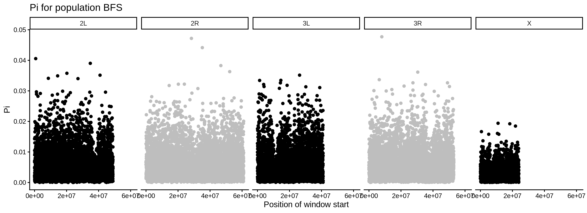

*************************
Understanding pixy output
*************************

Output file contents
====================

``pixy`` writes one output file per summary statistic that you request.
Each file is a tab-separated table, named
``[output_prefix]_[stat].txt`` (e.g. ``pixy_pi.txt``,
``pixy_watterson_theta.txt``). The columns in each file are documented
below.

Within-population nucleotide diversity (pi)
-------------------------------------------

File: ``[prefix]_pi.txt``

``pop``
    The ID of the population from the populations file.

``chromosome``
    The chromosome or contig.

``window_pos_1``
    First position of the genomic window.

``window_pos_2``
    Last position of the genomic window.

``avg_pi``
    Average per-site nucleotide diversity for the window. ``pixy``
    computes the *weighted average nucleotide diversity per site* over
    all sites in the window, where weights are determined by the number
    of genotyped samples at each site.

``no_sites``
    Total number of sites in the window with at least one valid
    genotype. This is included for the user and is not directly used in
    any calculation.

``count_diffs``
    Raw number of pairwise differences between all genotypes in the
    window. This is the numerator of ``avg_pi``.

``count_comparisons``
    Raw number of non-missing pairwise comparisons between all genotypes
    in the window. This is the denominator of ``avg_pi``.

``count_missing``
    Raw number of missing pairwise comparisons in the window.

Between-population nucleotide divergence (dxy)
----------------------------------------------

File: ``[prefix]_dxy.txt``

``pop1``, ``pop2``
    The IDs of the two populations being compared.

``chromosome``, ``window_pos_1``, ``window_pos_2``
    The chromosome and window coordinates (as for ``pi``).

``avg_dxy``
    Average per-site nucleotide divergence for the window.

``no_sites``
    Number of sites in the window with at least one valid genotype in
    *both* populations.

``count_diffs``, ``count_comparisons``, ``count_missing``
    Raw numerator, denominator and missing-comparison counts, defined
    analogously to the ``pi`` file but across the two populations.

F\ :sub:`ST` (fst)
------------------

File: ``[prefix]_fst.txt``

``pop1``, ``pop2``
    The IDs of the two populations being compared.

``chromosome``, ``window_pos_1``, ``window_pos_2``
    Window coordinates.

``avg_wc_fst`` *or* ``avg_hudson_fst``
    The window-averaged F\ :sub:`ST`, per SNP (not per site). Which
    column name you see depends on ``--fst_type``: ``wc`` (Weir &
    Cockerham 1984, the default) produces ``avg_wc_fst``; ``hudson``
    (Hudson 1992 / Bhatia *et al.* 2013) produces ``avg_hudson_fst``.

``no_snps``
    Total number of variable sites (SNPs) in the window.

Watterson's θ (watterson_theta)
-------------------------------

File: ``[prefix]_watterson_theta.txt``

Watterson's θ is an estimator of the population mutation rate computed
from the number of segregating sites. The unbiased estimator implemented
in ``pixy`` corrects for missing data and arbitrary ploidy. See Bailey,
Stevison & Samuk (2025) for the derivation.

``pop``
    The ID of the population.

``chromosome``, ``window_pos_1``, ``window_pos_2``
    Window coordinates.

``avg_watterson_theta``
    Per-site Watterson's θ for the window.

``no_sites``
    Total number of sites in the window with at least one valid
    genotype in the focal population.

``raw_watterson_theta``
    Sum of per-site θ contributions over the window, used as the
    numerator of ``avg_watterson_theta``.

``no_var_sites``
    Number of segregating (variant) sites in the window that
    contributed to the estimate.

``weighted_no_sites``
    Sum of the per-site weights across the window. Used as the
    denominator of ``avg_watterson_theta``.

Tajima's *D* (tajima_d)
-----------------------

File: ``[prefix]_tajima_d.txt``

Tajima's *D* contrasts two estimators of θ — π (based on pairwise
differences) and Watterson's θ (based on segregating sites) — to detect
departures from neutrality. ``pixy`` reports the unbiased estimator
described in Bailey, Stevison & Samuk (2025), which handles missing
data correctly.

``pop``
    The ID of the population.

``chromosome``, ``window_pos_1``, ``window_pos_2``
    Window coordinates.

``tajima_d``
    Tajima's *D* for the window.

``no_sites``
    Total number of sites in the window with at least one valid
    genotype.

``raw_pi``, ``raw_watterson_theta``
    The unbiased per-site π and Watterson's θ values used to compute
    *D* (the numerator is ``raw_pi - raw_watterson_theta``).

``tajima_d_stdev``
    Standard deviation of the *D* statistic over the window (the
    denominator).

Working with pixy output data
=============================

Plotting results
----------------

.. code:: r

    # Example R Script for simple output plots
    # Here, we use pi and dxy output files directly from pixy.

    library(ggplot2)

    # Provide path to input. Can be pi or dxy.
    # NOTE: this is the only line you should have to edit to run this code:
    inp <- read.table("pixy_dxy.txt", sep = "\t", header = TRUE)

    # Find the chromosome names and order them
    chroms <- unique(inp$chromosome)
    chrOrder <- sort(chroms)
    inp$chrOrder <- factor(inp$chromosome, levels = chrOrder)

    # Plot pi for each population found in the input file
    if ("avg_pi" %in% colnames(inp)) {
        pops <- unique(inp$pop)
        for (p in pops) {
            thisPop <- subset(inp, pop == p)
            popPlot <- ggplot(thisPop, aes(window_pos_1, avg_pi, color = chrOrder)) +
                geom_point() +
                facet_grid(. ~ chrOrder) +
                labs(title = paste("Pi for population", p),
                     x = "Position of window start", y = "Pi") +
                scale_color_manual(values = rep(c("black", "gray"),
                                                ceiling(length(chrOrder) / 2))) +
                theme_classic() +
                theme(legend.position = "none")
            ggsave(paste0("piplot_", p, ".png"), plot = popPlot,
                   device = "png", dpi = 300)
        }
    }

    # Plot Dxy for each combination of populations found in the input file
    if ("avg_dxy" %in% colnames(inp)) {
        pops <- unique(inp[c("pop1", "pop2")])
        for (p in 1:nrow(pops)) {
            combo <- pops[p, ]
            thisPop <- subset(inp,
                              pop1 == combo$pop1[[1]] & pop2 == combo$pop2[[1]])
            popPlot <- ggplot(thisPop, aes(window_pos_1, avg_dxy, color = chrOrder)) +
                geom_point() +
                facet_grid(. ~ chrOrder) +
                labs(title = paste("Dxy for", combo$pop1[[1]], "&", combo$pop2[[1]]),
                     x = "Position of window start", y = "Dxy") +
                scale_color_manual(values = rep(c("black", "gray"),
                                                ceiling(length(chrOrder) / 2))) +
                theme_classic() +
                theme(legend.position = "none")
            ggsave(paste0("dxyplot_", combo$pop1[[1]], "_",
                          combo$pop2[[1]], ".png"),
                   plot = popPlot, device = "png", dpi = 300)
        }
    }

Running the script on a ``pixy_pi.txt`` file produces one
``piplot_<pop>.png`` per population, faceted by chromosome. For example:

.. note::
    The figure above was produced by running the snippet on a simulated
    ``pixy_pi.txt`` table covering chromosomes ``2L``, ``2R``, ``3L``,
    ``3R`` and ``X`` — see :doc:`example_data` for the underlying VCF
    and the exact ``vcfsim`` command that produced it. The reduced
    diversity visible on the X chromosome is a common biological
    signal: the effective population size of an X-linked locus is
    roughly 3/4 that of an autosomal locus, so π is expected to be
    lower there.

For richer plotting workflows (long-format conversion, multi-statistic
panels, genome-wide plots) see :doc:`plotting`.

Post-hoc aggregating
--------------------

If you want to combine information across windows after the fact
(e.g. by averaging), **do not** simply average the per-window summary
statistics. Instead, sum the raw counts and recompute the ratio. For
``pi`` and ``dxy``:

.. parsed-literal::

    (window 1 count_diffs + window 2 count_diffs) /
    (window 1 count_comparisons + window 2 count_comparisons)

The same principle applies to Watterson's θ — sum the
``raw_watterson_theta`` and ``weighted_no_sites`` columns across
windows and divide. For Tajima's *D*, recompute from the raw π and θ
contributions; do not average ``tajima_d`` values directly across
windows.
