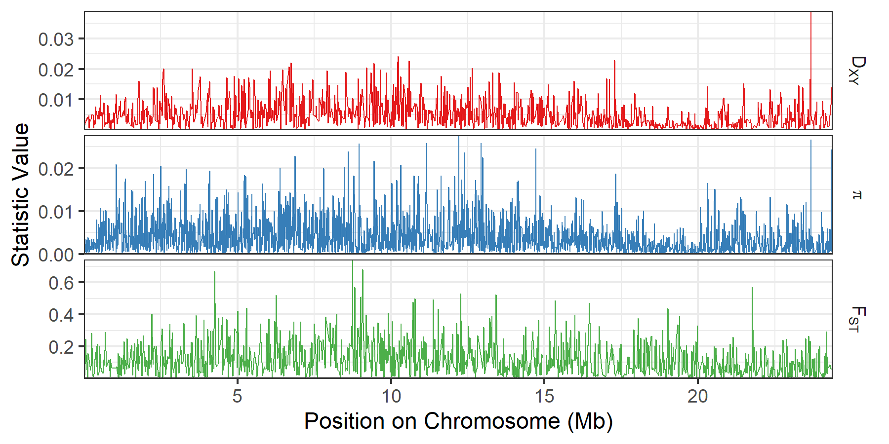
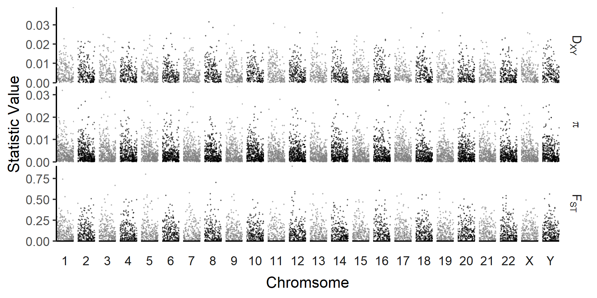

************
Plotting pixy output
************

A common method of visualizing population summary statistics is to create scatter or line plots of each statistic along the genome. Examples of how to do this using the `tidyverse packge <https://www.tidyverse.org/>`_ in R. are shown below.

Converting pixy output files to long format
================
The output files created by pixy are in wide format by default. Plotting in the tidyverse is much easier if data is in long format, and so the function below can be used to convert a list of pixy output files to a single long format data frame.

.. code:: r
    
    pixy_to_long <- function(pixy_files){
      
      pixy_df <- list()
      
      for(i in 1:length(pixy_files)){
        
        stat_file_type <- gsub(".*_|.txt", "", pixy_files[i])
        
        if(stat_file_type == "pi"){
          
          df <- read_delim(pixy_files[i], delim = "\t")
          df <- df %>%
            gather(-pop, -window_pos_1, -window_pos_2, -chromosome, 
                   key = "statistic", value = "value") %>%
            rename(pop1 = pop) %>%
            mutate(pop2 = NA)
          
          pixy_df[[i]] <- df
          
          
        } else{
          
          df <- read_delim(pixy_files[i], delim = "\t")
          df <- df %>%
            gather(-pop1, -pop2, -window_pos_1, -window_pos_2, -chromosome, 
                   key = "statistic", value = "value")
          pixy_df[[i]] <- df
          
        }
        
      }
      
      bind_rows(pixy_df) %>%
        arrange(pop1, pop2, chromosome, window_pos_1, statistic)
      
    }

For example, the below code converts all the pixy files found in the folder 'output' to a single data frame:

.. code:: r
    
    pixy_folder <- "output"
    pixy_files <- list.files(pixy_folder, full.names = TRUE)
    pixy_df <- pixy_to_long(pixy_files)

This results in a data frame (pixy_df) that looks like this:

.. parsed-literal::
    pop1 pop2 chromosome window_pos_1 window_pos_2         statistic       value
    BFS  KES          X            1        10000           avg_dxy 1.519710e-03
    BFS  KES          X            1        10000        avg_wc_fst 1.224767e-01
    BFS  KES          X            1        10000 count_comparisons 9.436012e+06
    BFS  KES          X            1        10000       count_diffs 1.434000e+04
    BFS  KES          X            1        10000     count_missing 2.649188e+06
    BFS  KES          X            1        10000          no_sites 8.049000e+03
    BFS  KES          X            1        10000           no_snps 1.310000e+02
    BFS  KES          X        10001        20000           avg_dxy 2.453347e-03
    BFS  KES          X        10001        20000        avg_wc_fst 1.479964e-01
    
Single chromosome view
================

We are often interested in local patterns of diversity along individual chromosomes. The below code plots the three main summary statistics calculated by pixy (pi, Dxy, FST) along a single chromosome. A custom labelling function is also provided to handle symbols/subscripts in the summary statistic's labels.

.. code:: r

    # custom labeller for special characters in pi/dxy/fst
    pixy_labeller <- as_labeller(c(avg_pi = "pi", 
                                 avg_dxy = "D[XY]", 
                                 avg_wc_fst = "F[ST]"),
                                 default = label_parsed)
    
    # plotting summary statistics along a single chromosome
    pixy_df %>%
      filter(chromosome == 1) %>%
      filter(statistic %in% c("avg_pi", "avg_dxy", "avg_wc_fst")) %>%
      mutate(chr_position = ((window_pos_1 + window_pos_2)/2)/1000000) %>%
      ggplot(aes(x = chr_position, y = value, color = statistic))+
      geom_line(size = 0.25)+
      facet_grid(statistic ~ ., 
                 scales = "free_y", switch = "x", space = "free_x",
                 labeller = labeller(statistic = pixy_labeller, 
                                     value = label_value))+
      xlab("Position on Chromosome (Mb)")+
      ylab("Statistic Value")+
      theme_bw()+
      theme(panel.spacing = unit(0.1, "cm"),
            strip.background = element_blank(),
            strip.placement = "outside",
            legend.position = "none")+
      scale_x_continuous(expand = c(0, 0))+ 
      scale_y_continuous(expand = c(0, 0))+
      scale_color_brewer(palette = "Set1")
	  
This results in the following plot :

	
A genome-wide plot of summary statistics
================

We can also visualize patterns of diversity at the genome wide scale. While finer scale patterns are lost, this can be useful for identifying chrosomal scale variation (e.g. depressed diversity on sex chromosomes), or visualizing the distribution of loci of interest (e.g. FST outliers, or GWAS hits).  Some common features of these types of plots (alterating chromosome colors, enforced chromosome order, axis limits) are included. 

.. code:: r

    # create a custom labeller for special characters in pi/dxy/fst
    pixy_labeller <- as_labeller(c(avg_pi = "pi", 
                                 avg_dxy = "D[XY]", 
                                 avg_wc_fst = "F[ST]"),
                                 default = label_parsed)
    
    # plotting summary statistics across all chromosomes
    pixy_df %>%
      mutate(chrom_color_group = case_when(as.numeric(chromosome) %% 2 != 0 ~ "even",
                                     chromosome == "X" ~ "even",
                                     TRUE ~ "odd" )) %>%
      mutate(chromosome = factor(chromosome, levels = c(1:22, "X", "Y"))) %>%
      filter(statistic %in% c("avg_pi", "avg_dxy", "avg_wc_fst")) %>%
      ggplot(aes(x = (window_pos_1 + window_pos_2)/2, y = value, color = chrom_color_group))+
      geom_point(size = 0.5, alpha = 0.5, stroke = 0)+
      facet_grid(statistic ~ chromosome, 
                 scales = "free_y", switch = "x", space = "free_x",
                 labeller = labeller(statistic = pixy_labeller, 
                                     value = label_value))+
      xlab("Chromsome")+
      ylab("Statistic Value")+
      scale_color_manual(values = c("grey50", "black"))+
      theme_classic()+
      theme(axis.text.x = element_blank(), 
            axis.ticks.x = element_blank(),
            panel.spacing = unit(0.1, "cm"),
            strip.background = element_blank(),
            strip.placement = "outside",
            legend.position ="none")+
      scale_x_continuous(expand = c(0, 0)) + 
      scale_y_continuous(expand = c(0, 0), limits = c(0,NA))
	  
This results in the following plot (using simulated data):

